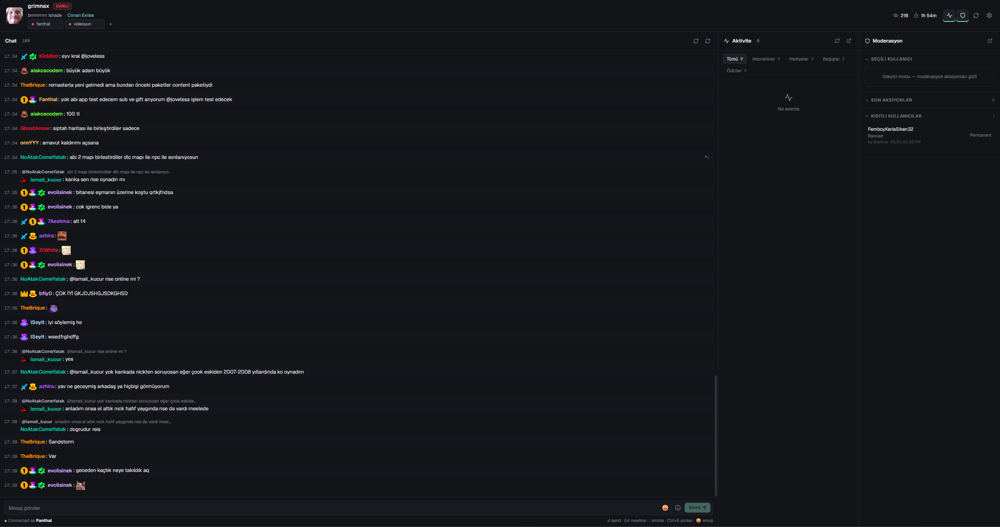

# Kick Chat Viewer

Kick.com kanal chat'ini ve moderasyon olaylarını masaüstünde tek pencerede izlemek için yazılmış **Electron + React + TypeScript** uygulaması. Aynı anda birden fazla kanala bağlanabilir, chat / aktivite / moderasyon panellerini yan yana gösterir, Kick'in resmi OAuth API'si üzerinden timeout / ban / unban / mesaj silme aksiyonları yapar. Otomasyon rutinleri ile chat olaylarına ve zamanlı tetikleyicilere otomatik yanıt verebilir.



## Özellikler

- **Multi-channel chat** — Tek pencerede birden çok Kick kanalına bağlanma, Pusher websocket üzerinden gerçek zamanlı mesaj akışı.
- **Aktivite paneli** — Abonelikler, gifted sub, KICKs, bağış, host/raid, follow ve channel point reward eventlerini ayrı sekmelerde gösterir.
- **Moderasyon paneli** — Seçili kullanıcı için timeout (preset / özel saniye), kalıcı ban, unban, mesaj silme. Son aksiyonlar log'u + kısıtlı kullanıcı listesi.
- **Kullanıcı detay penceresi (UserWindow)** — Profil, oturum mesajları (boşsa Kick API'den son mesajlar fetch edilir), oturum mod geçmişi, kişisel notlar.
- **Emote desteği** — Kick global + kanal emote'ları, kullanıcının abone olduğu kanalların emote union'u, 7TV global emote'lar; composer'da inline `` olarak render (DOM-first insert, Backspace/Delete ile silinebilir).
- **Emote picker + autocomplete** — Modal Kick emote picker (klavye nav + focus trap), `:emote` inline autocomplete, `@user` mention autocomplete, composer'da **Unicode emoji picker** (😀🎉 — `emoji-picker-react`).
- **Otomasyon Rutinleri** — Chat olaylarına otomatik yanıt: chat keyword, mention, sub/gift sub, follow, KICKs, host, reward redeem, **zamanlı (interval)** tetikleyiciler. Placeholder destekli mesajlar (`{username}`, `{amount}` vb.), cooldown, per-channel scope, hediye-sub-alıcı filtresi, live-only mod.
- **Modern UI shell** — OKLCH tabanlı design token sistemi, light/dark tema, i18n (TR/EN), tam responsive (panel pop-out + drawer modu).
- **Otomatik güncelleme kontrolü** — Açılışta GitHub Releases API üzerinden son sürüm kontrolü; yeni release çıktığında Settings → Güncelleme bölümünde "Güncelleme var" rozeti.
- **Sub/gift/host/follow/KICKs/reward banner'ları** — Sentetik chat satırları olarak chat'in içinde de görünür, sadece Aktivite panelinde değil.

## Otomasyon Rutinleri (Sprint 58 / 60)

Settings → **Rutinler** sekmesinden yönetilir. 4 hazır şablon (Sub'a teşekkür, Yeni takipçi karşılama, Mention yanıtı, 30dk'da bir hatırlatma) ile hızlı başlatma yapılabilir.

**Tetikleyiciler:**

| Tip | Açıklama |
|---|---|
| `chat_match` | Chat'te belirli kelime/regex (case opsiyonu, emote desteği) |
| `mention` | Belirli kullanıcı(lar) etiketlendiğinde |
| `sub_event` | Yeni abonelik (default: hediye-sub alıcıları filtrelenir) |
| `gift_sub_event` | Hediye sub geldiğinde (gifter için) |
| `follow_event` | Yeni takipçi delta'sı |
| `kicks_event` | KICKs bağışı (opsiyonel min tutar) |
| `host_event` | Host / raid |
| `reward_redeemed` | Channel point reward (opsiyonel title filtresi) |
| `interval` | **Zamanlı** — 15dk/30dk/1saat preset veya custom, live-only opsiyon |

**Aksiyonlar:** `send_message` (chat'e gönder) / `send_toast` (bana bildirim göster).

**Placeholder syntax:** `{username}` `{amount}` `{months}` `{tier}` `{message}` `{channel}` `{reward}`

**Diğer:**
- **Cooldown** — Rutin çalıştıktan sonra X saniye boyunca yeniden tetiklenmez (spam koruması).
- **Per-channel scope** — Boş = tüm kanallar; veya çoklu kanal seçimi (chip selector).
- **Hediye-sub filtresi** — `GiftedSubscriptionsEvent` alıcıları 5dk cache'lenir, hemen ardından gelen `SubscriptionEvent` `sub_event` rule'larında otomatik atlanır (opt-in `includeGifted` flag'i ile aç).
- **Live-only mod (interval)** — Kanal yayında değilse scheduler tick'i atlar; yayın açılınca devam eder.
- **Emote insert** — Hem trigger pattern hem mesaj içeriği `EmoteEditable` (contentEditable + DOM-first IMG insert) — Kick channel, Kick global, 7TV emote'ları görsel olarak görünür ve Backspace/Delete ile silinebilir.

## Teknik Stack

- **Runtime:** Electron 26, electron-builder, electron-updater
- **UI:** React 18, NextUI (legacy bileşenler), Tailwind, react-icons, react-toastify, emoji-picker-react
- **State:** Redux Toolkit
- **Realtime:** Kick Pusher websocket (`chatrooms.<chatroom_id>.v2`, `channel_<channel_id>`, `chatroom_<chatroom_id>`)
- **Auth:** Kick OAuth 2.1 PKCE flow (main process), `http://localhost:18291/kick/oauth/callback`
- **Build:** webpack tabanlı `.erb` konfigleri
- **Test:** Jest + Testing Library + jsdom
- **Language:** TypeScript strict

## Kurulum

```bash
git clone https://github.com/Fanthall/kick-chat-view.git
cd kick-chat-view
npm install
```

> **Gereksinim:** Node `>=24.11.1`, npm `>=10`. Eski Node ile postinstall / native rebuild kırılabilir.

## Geliştirme

```bash
npm start            # renderer dev server + Electron main
npm run start:main   # sadece main process (dev mode)
```

## Build & Paketleme

```bash
npm run build         # main + renderer production build
npm run package       # dist temizle, build al, electron-builder ile paketle (NSIS installer)
```

Paketlenmiş çıktı: `release/build/Kick Chat Viewer Setup <version>.exe`

## Test

```bash
npm test       # Jest test suite (164+ test)
npm run lint   # ESLint kontrolü
```

## Kick OAuth & Scope

İlk kullanımda uygulama Kick OAuth login'ini açar. Varsayılan scope seti (`src/shared/kickScopes.ts`):

`user:read`, `channel:read`, `channel:write`, `channel:rewards:read`, `channel:rewards:write`, `chat:write`, `streamkey:read`, `events:subscribe`, `moderation:ban`, `moderation:chat_message:manage`, `kicks:read`

Token + Kick app config `app.getPath("userData")/kick-oauth.json` altında tutulur. Renderer doğrudan token'la iş yapmaz — main process `kickService.ts` üzerinden tüm API çağrıları proxylenir.

> Kick Developer App tarafında redirect URI uygulamadaki callback URL ile birebir aynı olmalı: `http://localhost:18291/kick/oauth/callback`.

## Mimari Harita

| Dosya | Görev |
|---|---|
| `src/main/main.ts` | Electron main process, BrowserWindow, auto-updater |
| `src/main/preload.ts` | Typed IPC bridge (`window.electron.*`) |
| `src/main/kickOAuth.ts` | OAuth 2.1 PKCE flow |
| `src/main/kickService.ts` | Resmi Kick API wrapper (channel / livestream / chat / moderation / events) |
| `src/main/githubUpdate.ts` | GitHub Releases update check (unauth, public repo) |
| `src/renderer/App.tsx` | Bootstrap (7TV emote yükle, chatListener dispatch) |
| `src/renderer/src/Layout/LayoutModern.tsx` | 3-kolonlu modern shell (Chat / Activity / Moderation) |
| `src/renderer/src/Chat/ChatModern.tsx` | Ana chat render'ı, contentEditable composer, mention/emote autocomplete, inline emoji picker |
| `src/renderer/src/Chat/EmotePickerModern.tsx` | Modal Kick emote picker (focus trap) |
| `src/renderer/src/ActivityView/ActivityViewModern.tsx` | Activity panel (sub / gift / KICKs / host / follow / reward) |
| `src/renderer/src/ModActions/ModActionsModern.tsx` | Moderation panel: user card, timeout / ban / unban |
| `src/renderer/src/UserWindow/UserWindow.tsx` | Kullanıcı detay pop-up'ı (Overview / Messages / Activity / Mod history / Notes) |
| `src/renderer/src/Settings/SettingsModern.tsx` | Ayarlar (kanal, OAuth, tema, dil, güncelleme, bloklu emote, suspended user) |
| `src/renderer/src/Settings/AutomationSection.tsx` | Otomasyon rutinleri editörü |
| `src/renderer/src/Settings/EmoteEditable.tsx` | contentEditable input + emote IMG render (trigger pattern / message content) |
| `src/renderer/util/automationRules.ts` | Tip tanımları, placeholder replacer, pattern matcher |
| `src/renderer/util/automationRulesStorage.ts` | localStorage I/O |
| `src/renderer/util/automationRulesEngine.ts` | Engine: rule cache, cooldown, scheduler (interval), gift recipient filter, live status cache |
| `src/renderer/util/composerDom.ts` | contentEditable helpers: extract / replace / insert / backspace-delete |
| `src/renderer/util/chatConnection.ts` | Pusher abonelik + event parse/dispatch merkezi (automation hook'ları dahil) |
| `src/renderer/store/reducer/chatMessage.ts` | Chat, mod aksiyonları, subscription, host/raid state |

## Kanal & Kullanıcı Ayarları

LocalStorage anahtarları proje sözleşmesi gibi kullanılır:

- `channelName` — Aktif kanal (legacy, tek-kanal modu)
- `channelTabs` — Modern shell çoklu kanal tab'ları
- `username` — Mention highlight için kullanıcı adı
- `susUsers` — Suspended (şüpheli) kullanıcı listesi
- `blockEmotes` — Bloklanan emote listesi
- `chatViewLocale` — `tr` | `en`
- `chatViewTheme` — `dark` | `light`
- `chatViewAutomationRules` — Otomasyon rutinleri JSON array

## Güncelleme Akışı

- Açılışta `Settings → Güncelleme` bölümü `https://api.github.com/repos/Fanthall/kick-chat-view/releases/latest` çağrısı yapar.
- Versiyon karşılaştırması `compareVersions` (semver-ish) ile.
- Yeni release varsa `İndir` butonu doğrudan tarayıcıda Release sayfasını açar.
- electron-builder + electron-updater configure: `Fanthall/kick-chat-view` (public repo, PAT gereksiz).

## Geliştirme Notları

- Chat HTML'i `renderMessageHtml` / `buildBadgesHtml` üzerinden sanitize edilir; raw `dangerouslySetInnerHTML` bu helperlerin dışında kullanılmaz.
- Tüm Modern UI CSS değişkenleri `[data-app-shell="modern"]` altında scope'lanmıştır; NextUI veya legacy stillere bulaşmaz.
- Reducer listeleri 500 elemanda truncate edilir.
- Raid/host için resmi Kick API endpoint'i olmadığından `StreamHostEvent` Pusher üzerinden izlenir.
- Composer + EmoteEditable'da emote'lar `` olarak DOM'da tutulur; `extractComposerText` bunları kanonik metne çevirir.
- Otomasyon engine'i `chatConnection.ts` event dispatch'lerine hook'lanır; storage event ile cross-tab senkronizasyon yapar; `interval` rule'lar için `setInterval` scheduler + 60sn live-status cache kurar.

## Sürüm

Mevcut sürüm: **v4.6.4** (release/app/package.json)

Release Notes: [GitHub Releases](https://github.com/Fanthall/kick-chat-view/releases)

## Lisans

MIT © Fanthal (Sezer Demir DEDEK)

Bu proje [electron-react-boilerplate](https://github.com/electron-react-boilerplate/electron-react-boilerplate) üzerine kurulmuştur.
